<!--
Source unique du guide de l'équipe en Word (Guide-equipe-Yume-Novel.docx).
Après chaque modification : node tools/guide/construire.js (voir tools/guide/README.md).

Syntaxe reconnue par tools/guide/construire.js :
  # Chapitre / ## Procédure / ### Intertitre   (numérotés automatiquement : ne pas écrire « 1. »)
  paragraphe, **gras** (boutons et menus), *italique*
  1. étape numérotée        - puce (deux espaces devant pour une sous-puce)
  > **À savoir** : …  /  > **Attention** : …  /  > **Astuce** : …  /  > **Nouveau** : …   (encadrés)
  | tableau | en | barres |
     ou   {largeur=60%}
Le texte placé avant le premier chapitre figure sur la page de titre.
Les noms de boutons s'écrivent exactement comme à l'écran (le code du site fait foi).
-->

Ce guide explique, pas à pas, comment utiliser l'espace équipe de Yume Novel : tenir le planning à jour, créer un tome, y ajouter des chapitres, le terminer et répondre aux lecteurs. Il s'adresse aux traducteurs, relecteurs, graphistes, éditeurs et gérants.

Chaque procédure répond à un seul objectif. Suivez les étapes dans l'ordre. Les noms des boutons sont écrits en **gras**, exactement comme à l'écran.

Les images viennent des maquettes validées par l'équipe. Un détail peut différer de l'écran réel : dans ce cas, le texte du guide fait foi. Ce guide évolue avec le site : sa version est indiquée en bas de chaque page.

# Bienvenue dans l'espace équipe

## À quoi sert l'espace équipe

L'espace équipe est la partie du site réservée à l'équipe, à l'adresse **yumenovel.fr/equipe/**. Tout s'y fait sans passer par l'administration de WordPress :

- suivre ses tâches et mettre à jour le planning ;
- créer les œuvres et les tomes ;
- ajouter les chapitres d'un tome, les programmer et les annoncer ;
- publier les glossaires et modérer les commentaires ;
- pour les gérants : gérer les membres et régler le site.

Le site fait le reste tout seul : pages de lecture, annonces sur Discord, e-mails aux lecteurs, rappels de planning.

## Qui peut faire quoi

Chaque membre a un rôle. Un rôle se demande à un gérant.

| Rôle | Peut |
| --- | --- |
| **Traducteur**, **Relecteur**, **Graphiste** | Voir l'espace équipe et tout le planning. Mettre à jour l'avancement des tomes dont il est responsable. Envoyer des images. |
| **Éditeur Yume** | Tout ce qui précède, plus : créer et modifier les œuvres et les tomes, ajouter des chapitres, mettre à jour le planning de tous les tomes, publier les glossaires, écrire des actualités, modérer les commentaires. |
| **Gérant** | Tout ce qui précède, plus : gérer les membres et leurs rôles, voir les indicateurs et la santé du site, modifier les réglages. |

> **À savoir** : chacun ne voit que les menus dont son rôle a besoin. Une entrée absente n'est pas une panne.

## Se connecter

1. Sur le site, cliquez sur **Connexion** en haut à droite (page **yumenovel.fr/connexion/**).
2. Saisissez votre **Pseudo ou adresse e-mail**, puis votre **Mot de passe**.
3. Sur un appareil personnel, cochez **Se souvenir de moi**.
4. Cliquez sur **Se connecter**.
5. Ouvrez l'espace équipe : menu du compte, puis **Espace équipe**. Les traducteurs, relecteurs et graphistes y arrivent directement.

Mot de passe oublié : cliquez sur **Mot de passe oublié ?** sous le formulaire. Un lien arrive par e-mail.

> **Attention** : après 5 erreurs en 15 minutes, le formulaire est bloqué 15 minutes. Attendez, ou cliquez sur **Mot de passe oublié ?** pour recevoir un lien.

> **Attention** : ne partagez jamais votre compte. Chaque action est enregistrée au nom de son auteur dans le journal de l'équipe.

Pour quitter : **Se déconnecter**, sous votre nom dans le menu de l'espace équipe.

# Le tableau de bord et le menu

## Lire le tableau de bord

Le tableau de bord est la première page de l'espace équipe. Il commence par « Bonjour » et votre pseudo, puis rassemble :

- **En bref** : **Mes tâches en cours**, **Mes retards**, la **Prochaine sortie équipe** et les **Rappels ce mois** ;
- **Mes tâches** : les tomes dont vous êtes responsable, avec leur étape, leur avancement et leur date cible ;
- **Tomes en préparation** : le planning à venir, avec le bouton **Nouveau tome** ;
- **Rappels et journal** : les retards et blocages, les derniers rappels envoyés et les dernières mises à jour de l'équipe.

## Se repérer dans le menu

Le menu est à gauche de chaque page. **Tableau de bord** et **Mes tâches** sont toujours en haut. Viennent ensuite quatre rubriques qui se replient : **Catalogue**, **Planning**, **Équipe** et **Site**. La rubrique de la page affichée est ouverte.

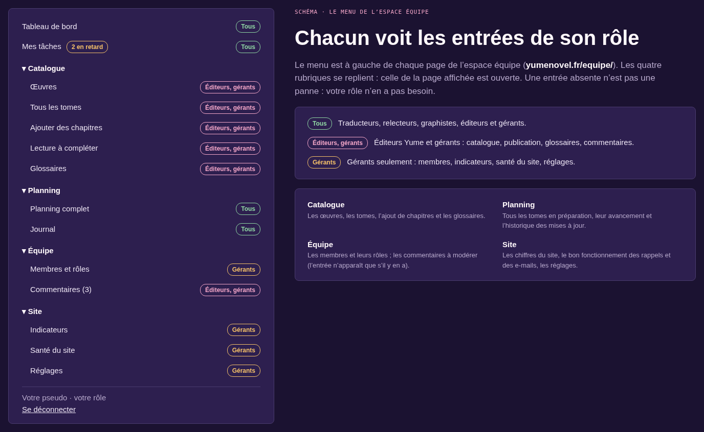

> **À savoir** : la pastille à côté de **Mes tâches** compte vos retards. L'entrée **Commentaires** n'apparaît que s'il y a des commentaires à modérer.

## Utiliser les raccourcis d'un tome

Sous chaque tâche et chaque tome du planning, des liens mènent directement au bon écran :

- **Publier ce tome** (éditeurs) : ouvre « Ajouter des chapitres » avec ce tome déjà choisi ;
- **Gérer dans le planning complet** : ouvre la ligne du tome dans le planning ;
- **Voir la fiche** : la page publique du tome, s'il est en ligne ;
- **Historique** : le journal de ce tome ;
- **Modifier dans l'administration** : l'écran avancé de WordPress (rarement utile).

# Le planning

Le planning public (**yumenovel.fr/planning/**) montre aux lecteurs où en est chaque tome. Il se met à jour uniquement avec ce que l'équipe saisit. Pensez-y à chaque avancée.

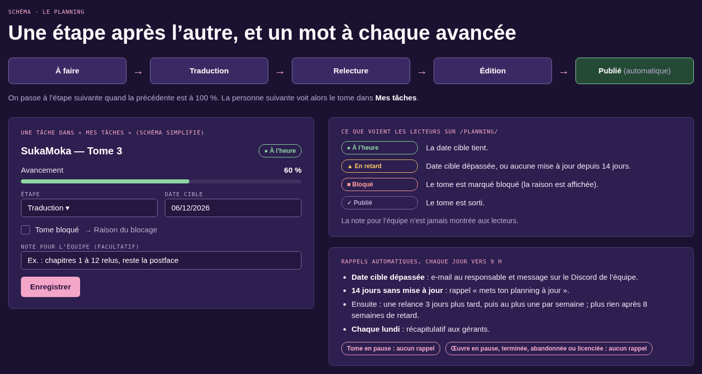

## Mettre à jour son avancement

1. Ouvrez **Mes tâches** dans le menu. Les tâches en retard sont en tête.
2. Trouvez le tome.
3. Faites glisser le curseur **Avancement** (de 0 à 100 %) de votre étape.
4. Si votre étape est finie, choisissez l'étape suivante dans **Étape** : *À faire*, *Traduction*, *Relecture*, *Édition*. La personne suivante verra alors le tome dans ses tâches.
5. Vérifiez la **Date cible** : la date de sortie visée.
6. Si besoin, écrivez un mot dans **Note pour l'équipe (facultatif)**. Les lecteurs ne la voient jamais.
7. Cliquez sur **Enregistrer**.

> **À savoir** : on ne passe à l'étape suivante que si les étapes précédentes sont à 100 %. Seuls les gérants peuvent forcer une étape. L'étape **Publié** se pose toute seule à la sortie du tome.

> **À savoir** : vous ne pouvez modifier que les tomes dont vous êtes responsable, et seulement votre étape. Un tome manque dans vos tâches ? Demandez à un éditeur ou à un gérant de vous l'attribuer.

## Signaler un tome bloqué

Un tome ne peut plus avancer (relecteur manquant, illustrations en attente…) :

1. Dans **Mes tâches**, trouvez le tome.
2. Cochez **Tome bloqué**.
3. Écrivez la raison dans **Raison du blocage**. Elle s'affiche sur le planning public.
4. Cliquez sur **Enregistrer**.

Quand le tome repart, décochez **Tome bloqué** et enregistrez.

## Mettre à jour une tâche « En attente »

Une tâche **En attente** attend l'étape précédente : par exemple, la relecture attend la fin de la traduction. Elle n'est pas en retard pour vous. Pour la modifier quand même, cliquez sur **Mettre à jour quand même**, remplissez, puis **Enregistrer**.

## Comprendre ce que voient les lecteurs

| État sur le planning public | Signification |
| --- | --- |
| **À l'heure** | La date cible tient. |
| **En retard** | La date cible est dépassée, **ou** personne n'a mis le tome à jour depuis 14 jours. |
| **Bloqué** | Le tome est marqué bloqué. La raison est affichée. |
| **Publié** | Le tome est sorti. |
| **En cours de publication** | Le tome sort chapitre par chapitre, lisible en ligne au fil des sorties. |
| **Chapitre programmé** | La date et l'heure de sortie du prochain chapitre. |

Les lecteurs voient l'étape, les pourcentages, le pseudo des responsables et la date cible. Ils ne voient jamais la note pour l'équipe. Le planning nourrit aussi la section **Planning** de l'accueil : voir « Ce que voient les lecteurs ».

## Recevoir (ou ne plus recevoir) les rappels

Chaque jour vers 9 h, le site relit le planning :

- **date cible dépassée** : e-mail au responsable et message sur le Discord de l'équipe ;
- **aucune mise à jour depuis 14 jours** : rappel « mets ton planning à jour » ;
- **chaque lundi** : récapitulatif envoyé aux gérants.

Les rappels d'un même tome s'espacent : un premier rappel, une relance trois jours plus tard, puis au plus un par semaine. Après 8 semaines de retard, le site ne relance plus personne : le tome reste seulement dans le récapitulatif des gérants.

Pour ne plus recevoir de rappel : mettez le tome à jour. Même un petit pourcentage compte.

> **À savoir** : un tome **en pause** ne reçoit jamais de rappel (voir « Mettre un tome en pause »).

> **Nouveau** : version 2.1.5. Une œuvre **en pause**, **terminée**, **abandonnée** ou **licenciée** n'envoie plus aucun rappel ni alerte de retard, pour aucun de ses tomes. Voir le chapitre « Nouveau (version 2.1.5) : l'état des tomes et des œuvres ».

## Mettre un tome en pause

Réservé aux éditeurs et aux gérants. Pour un tome arrêté volontairement : attente de la VO, équipe indisponible, tome ancien jamais repris.

1. Dans le menu, ouvrez **Planning**, puis **Planning complet**.
2. Dépliez la ligne du tome.
3. Cliquez sur **Mettre en pause**.

Le tome n'est plus jamais en retard et ne reçoit plus de rappel. Un badge **En pause** le signale dans l'espace équipe. Les lecteurs ne voient rien.

Le jour où le tome repart : même chemin, bouton **Reprendre**.

## Retirer un tome ajouté par erreur

Réservé aux éditeurs et aux gérants, pour un tome **brouillon sans aucun chapitre en ligne**.

1. **Planning complet**, puis dépliez la ligne du tome.
2. Cliquez sur **Retirer du planning** et confirmez.

Le tome part à la corbeille. Un administrateur peut le récupérer. Un tome qui a des chapitres en ligne ne se retire pas ici.

## Trouver un tome dans le planning complet

**Planning complet** montre tous les tomes : en préparation, programmés, publiés.

- Filtrez par **Œuvre**, **État**, **Statut** ou responsable, puis **Filtrer**. **Afficher tout le planning** retire les filtres.
- Le tri **En retard d'abord** met en tête les tomes les plus en retard.
- **Exporter en CSV** télécharge le planning affiché, pour Excel ou LibreOffice.
- **Voir le planning public** ouvre la page vue par les lecteurs.

# Les œuvres

Réservé aux éditeurs et aux gérants. Menu **Catalogue**, puis **Œuvres**.

## Créer une œuvre

1. Ouvrez **Catalogue**, puis **Œuvres**.
2. Cliquez sur **Nouvelle œuvre**.
3. Remplissez au moins le **Titre** et le **Type**. Ajoutez le **Statut de la traduction**, l'**Auteur**, l'**Illustrateur**, l'**Éditeur VO** et les **Genres**.
4. Écrivez le **Synopsis**. Une ligne vide sépare deux paragraphes.
5. Ajoutez la couverture : JPG, PNG ou WebP, au format portrait de préférence.
6. Si besoin, dépliez **Fiche détaillée : VO, jours de sortie, équipe, liens**.
7. Cliquez sur **Créer en brouillon** (invisible du public) ou sur **Créer et publier** (visible tout de suite dans la bibliothèque).

> **À savoir** : publier une œuvre n'envoie aucune annonce. Seuls les tomes et les chapitres sont annoncés.

> **Astuce** : une œuvre en brouillon peut déjà recevoir des tomes au planning. Publiez-la ensuite d'un clic avec **Publier**, sur sa ligne.

> **Attention** : un titre déjà pris par une autre œuvre, même en brouillon, est refusé. Cherchez d'abord l'œuvre dans la liste.

## Modifier une œuvre et cadrer sa couverture

1. Dans **Œuvres**, cliquez sur **Modifier** à côté de l'œuvre.
2. Changez ce qu'il faut.
3. Sous **Cadrage de la couverture**, cliquez dans l'aperçu sur la partie à garder visible, ou réglez les curseurs. **Recentrer** revient au cadrage par défaut.
4. Cliquez sur **Enregistrer**.

Sur chaque ligne de la liste, vous trouvez aussi **Ajouter un tome au planning** (ouvre « Nouveau tome » avec l'œuvre déjà choisie) et **Ajouter des chapitres**.

## Gérer les genres

En bas de la page **Œuvres**, la liste **Genres** propose une trentaine de genres courants. Pour en ajouter, écrivez-les dans **Nouveaux genres (séparés par des virgules)**, puis **Ajouter**. **Supprimer** retire un genre de toutes les œuvres qui l'avaient.

> **Nouveau** : version 2.1.5. L'état de chaque œuvre (en cours de publication, terminée, en pause, abandonnée, licenciée) se change directement dans la liste **Œuvres**. Voir « Changer l'état d'une œuvre ».

# Créer un tome vide

Un tome se crée d'abord vide, sans fichier : il entre au planning. Ses chapitres arrivent ensuite avec « Ajouter des chapitres ». Réservé aux éditeurs et aux gérants.

## Ouvrir la page « Nouveau tome »

Plusieurs boutons ouvrent la même page :

- **Nouveau tome**, en haut de **Tous les tomes** ou sous **Tomes en préparation** du tableau de bord ;
- **Ajouter un tome au planning**, dans **Planning complet** ou sur la ligne d'une œuvre (l'œuvre est alors déjà choisie).

## Créer le tome

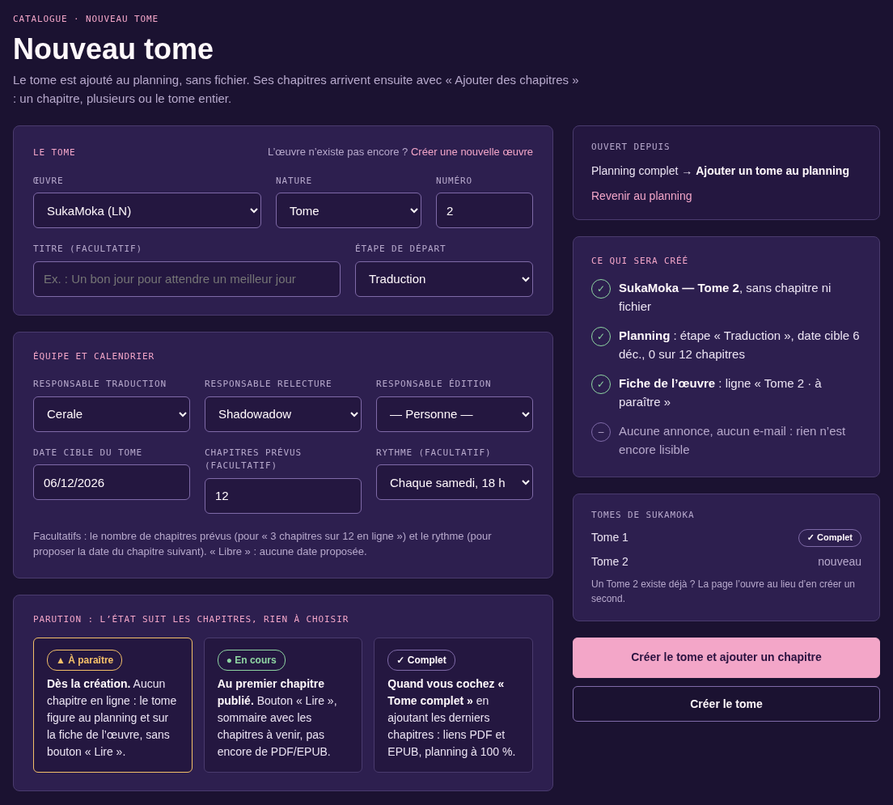

1. Dans **Le tome**, choisissez l'**Œuvre**. Elle n'existe pas encore ? Cliquez sur **Créer une nouvelle œuvre**.
2. Choisissez la **Nature** (Tome, Arc, Tome EX, Bonus…) et le **Numéro**. Un tome intermédiaire peut avoir un numéro comme 26,5.
3. Si le tome a un titre, remplissez **Titre (facultatif)**.
4. Choisissez l'**Étape de départ** du planning.
5. Dans **Équipe et calendrier**, choisissez les responsables (traduction, relecture, édition) et la **Date cible du tome**.
6. Indiquez les **Chapitres prévus (facultatif)** : le site affichera alors « 3 chapitres sur 12 en ligne ».
7. Choisissez le **Rythme (facultatif)** : un jour de la semaine et une **Heure de sortie** (18 h par défaut). Le site proposera alors la date du chapitre suivant. « Libre » : aucune date proposée.
8. Relisez **Ce qui sera créé**, à droite.
9. Cliquez sur **Créer le tome** (ouvre la fiche du tome) ou sur **Créer le tome et ajouter un chapitre** (ouvre « Ajouter des chapitres » avec ce tome).

> **À savoir** : rien n'est encore lisible. Aucune annonce, aucun e-mail. Le tome apparaît au planning et sur la fiche de l'œuvre comme « à paraître ».

> **Astuce** : si l'œuvre a déjà un tome de même nature et de même numéro, sa fiche s'ouvre au lieu d'en créer un second. Pas de doublon possible.

## Comprendre la parution d'un tome

L'état d'un tome suit ses chapitres : le site le met à jour tout seul.

| État (équipe) | Les lecteurs voient | Quand |
| --- | --- | --- |
| **Planifié** | À paraître | Dès la création, tant qu'aucun chapitre n'est en ligne. Le tome figure au planning, sans bouton « Lire ». |
| **En cours de publication** | En cours | Au premier chapitre publié. Le tome se lit en ligne, ses chapitres sortent au fil de l'eau. |
| **Publié** | Publié | Quand l'équipe coche « Le tome est complet : tout publier maintenant », à la sortie du dernier chapitre avec « Publier les liens avec le dernier chapitre », ou quand elle choisit « Publié ». Tous les chapitres sont en ligne, les liens PDF et EPUB s'affichent. |

> **Nouveau** : version 2.1.5. L'équipe peut aussi changer l'état du tome à la main : **Planifié**, **En cours de publication** ou **Publié**. Voir le chapitre « Nouveau (version 2.1.5) : l'état des tomes et des œuvres ».

# Préparer le fichier Word

Le fichier Word (DOCX) du tome est la source de la lecture en ligne. Le site le découpe tout seul en chapitres, à condition d'utiliser les bons styles. Le fichier n'est pas gardé sur le site : seuls les chapitres et les illustrations restent.

## Utiliser les bons styles

| Dans Word | Sur le site |
| --- | --- |
| Style **Titre 1** : « Chapitre 1 », « Chapitre 2 »… | Un nouveau chapitre (une page de lecture) |
| Style **Titre 2** juste après le Titre 1 | Le sous-titre du chapitre |
| Style **Titre 2** seul : « Prologue », « Postface »… | Un chapitre spécial, sans numéro |
| Paragraphe qui commence par « — », ou liste à puce « — » | Un dialogue (tiret long, en retrait) |
| Style **Pensée** | Une pensée (italique, en retrait) |
| Paragraphe centré | Un paragraphe centré |
| `***`, `* * *` ou `◇` seul sur une ligne | Un changement de scène |
| Image JPG, PNG ou WebP dans le texte | Une illustration pleine largeur |
| Images placées avant le premier Titre 1 | La galerie d'illustrations du tome |
| Notes de bas de page | Des notes en fin de chapitre |

Les en-têtes et pieds de page de Word sont ignorés. Les sauts de page ne changent rien au texte.

## Écrire les dialogues et les pensées

- Un dialogue commence par un tiret long « — » (tiret cadratin). Dans Word : **Ctrl + Alt + -** (signe moins du pavé numérique), ou copiez-le.
- Une pensée utilise le style **Pensée**. Ne la mettez pas seulement en italique : le site ne la reconnaîtrait pas comme une pensée.

## Décrire les illustrations

Le **texte de remplacement** d'une image devient sa description pour les lecteurs aveugles ou malvoyants.

1. Dans Word, faites un clic droit sur l'image.
2. Choisissez **Afficher le texte de remplacement**.
3. Si la case « Marquer comme décoratif » est cochée, décochez-la.
4. Écrivez une phrase courte qui décrit l'illustration : qui, quoi, où.

> **Attention** : les descriptions écrites par Word tout seul (« Une image contenant texte… », « Le contenu généré par l'IA peut être incorrect ») sont ignorées par le site. Écrivez la vôtre. Sans texte, le site met « Œuvre, Tome N, Chapitre N — illustration ».

## Forcer un début de chapitre avec un marqueur

Quand le découpage automatique se trompe (roman sans styles de titre, histoire bonus avant le premier chapitre…), ajoutez un paragraphe seul, sur sa propre ligne, au début de chaque chapitre :

| Marqueur | Effet |
| --- | --- |
| `[chapitre]` ou `[chapitre] Titre` | Un chapitre numéroté, avec ce titre |
| `[prologue]`, `[épilogue]`, `[postface]` | Un chapitre spécial |
| `[interlude] Titre`, `[bonus] Titre` | Un interlude ou un bonus, avec ce titre |

Le marqueur n'est jamais publié. Majuscules et accents sont indifférents.

> **Astuce** : sans toucher au fichier, vous pouvez aussi découper les chapitres à la souris, sur le site. Voir « Découper soi-même les chapitres ».

## Vérifier le fichier avant de l'envoyer

1. Chaque chapitre commence par un **Titre 1**.
2. Les dialogues commencent par « — ».
3. Les pensées utilisent le style **Pensée**.
4. Chaque illustration a son texte de remplacement.
5. Le fichier ne contient que les chapitres à publier, ou le tome avec ses chapitres déjà en ligne (ils seront reconnus et laissés tels quels).

# Ajouter des chapitres à un tome

Réservé aux éditeurs et aux gérants. Un seul formulaire sert à tous les cas : un chapitre, plusieurs, ou le tome entier. Menu **Catalogue**, puis **Ajouter des chapitres**. Ou, dans **Tous les tomes**, le bouton **Ajouter des chapitres** sur la ligne du tome : le tome est alors déjà choisi.

## Comprendre le formulaire

Le formulaire a trois parties numérotées et un résumé à droite.

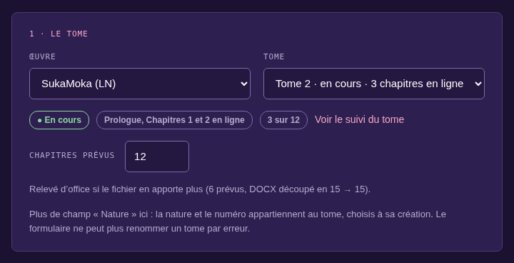{largeur=80%}

**1 · Le tome** : choisissez l'**Œuvre**, puis le **Tome**. La liste montre la parution de chaque tome. La nature et le numéro du tome ne changent jamais ici. Le tome n'existe pas ? **+ Nouveau tome**.

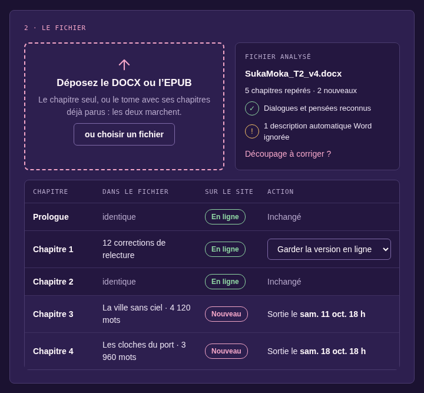{largeur=80%}

**2 · Le fichier** : déposez le DOCX (ou l'EPUB). Le site compare chaque chapitre du fichier aux chapitres du tome :

| Sur le site | Ce qui se passe |
| --- | --- |
| **Nouveau** | Le chapitre est ajouté au tome. Il sort selon la partie 3. |
| **En ligne, identique** | Rien ne change. |
| **En ligne, modifié** | Au choix : **Garder la version en ligne** (par défaut) ou **Mettre à jour (sans annonce)**. |
| **Programmé** ou **Brouillon** | Pas encore visible des lecteurs : mis à jour. |

Rien n'est jamais retiré : un chapitre en ligne absent du fichier reste en ligne.

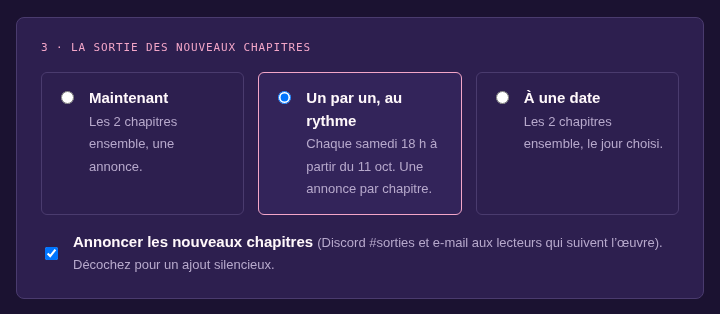{largeur=80%}

**3 · La sortie des nouveaux chapitres** :

- **Maintenant** : les nouveaux chapitres ensemble, une seule annonce ;
- **Un par un, au rythme** : un chapitre à chaque date du rythme du tome (par exemple chaque samedi à 18 h), une annonce à chaque sortie ;
- **À une date** : les nouveaux chapitres ensemble, le jour choisi.

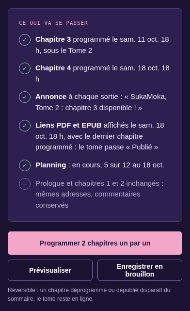{largeur=45%}

**Ce qui va se passer** résume l'envoi avant de cliquer : chapitres créés et leur date, annonces, planning. Le bouton d'envoi dit exactement ce qu'il va faire : « Publier 1 chapitre », « Programmer 2 chapitres un par un »… **Prévisualiser** et **Enregistrer en brouillon** ne montrent rien aux lecteurs.

## Publier le prologue d'un tome en cours

Exemple : SukaMoka, Tome 2. Le tome a été créé avec « Nouveau tome ». On publie d'abord le prologue seul.

1. Ouvrez **Ajouter des chapitres**.
2. Dans **1 · Le tome**, choisissez l'œuvre, puis le tome (il est « à paraître »).
3. Dans **2 · Le fichier**, déposez un DOCX qui contient **seulement le prologue**.
4. Vérifiez le tableau : le prologue est **Nouveau**.
5. La première fois, ajoutez la **Couverture** du tome (zone « Glissez l'image ici ») et remplissez les **Crédits du tome** à droite : **Traduction**, **Relecture**, **Édition / couverture**.
6. Dans **3 · La sortie des nouveaux chapitres**, choisissez **Maintenant**.
7. Laissez cochée **Annoncer les nouveaux chapitres**. Ne cochez ni **Publier les liens avec le dernier chapitre** ni **Le tome est complet : tout publier maintenant**.
8. Relisez **Ce qui va se passer**, puis cliquez sur **Publier 1 chapitre**.
9. Une fenêtre demande confirmation : cliquez sur **OK**.

Résultat : le prologue est en ligne. Le tome passe « En cours ». Un article et un message Discord annoncent « SukaMoka, Tome 2 : Prologue disponible ! » et les lecteurs qui suivent l'œuvre reçoivent un e-mail. Au planning, l'avancement suit les chapitres en ligne.

> **Attention** : tous les chapitres **Nouveau** du fichier sortent ensemble. Pour publier seulement le prologue, déposez un fichier qui ne contient que lui. Ou bien programmez les chapitres suivants (procédure suivante).

## Programmer plusieurs chapitres au rythme

Exemple : les chapitres 3 et 4 doivent sortir les deux samedis suivants, à 18 h.

1. Ouvrez **Ajouter des chapitres** et choisissez le tome.
2. Déposez le DOCX. Il peut contenir tout le tome : les chapitres déjà en ligne sont reconnus (**En ligne, identique**) et ne bougent pas.
3. Vérifiez que les chapitres 3 et 4 sont **Nouveau**. La colonne « Action » donne leur date de sortie.
4. Choisissez **Un par un, au rythme**. Le premier chapitre sort à la prochaine date du rythme, après le dernier chapitre déjà programmé.
5. Laissez cochée **Annoncer les nouveaux chapitres**.
6. Cliquez sur **Programmer 2 chapitres un par un**, puis confirmez.

Chaque chapitre sort à sa date, avec sa propre annonce : « SukaMoka, Tome 2 : chapitre 3 disponible ! ».

> **À savoir** : le fichier contient plus de chapitres que prévu (tome planifié à 6 chapitres, DOCX découpé en 15) ? Le champ **Chapitres prévus** de la fiche du tome, en haut du formulaire, est relevé d'office à 15 à l'enregistrement. Vous pouvez aussi y saisir le bon nombre vous-même.

> **À savoir** : le tome n'a pas de rythme ? Indiquez la **Date** de départ et le nombre de jours dans **Un chapitre tous les (jours)** (7 par défaut). Pour donner un rythme au tome, voir « Modifier les informations d'un tome ».

## Publier un tome entier d'un coup

Pour un tome traduit en entier, publié en une fois avec ses liens de téléchargement.

1. Créez le tome avec **Nouveau tome**, puis cliquez sur **Créer le tome et ajouter un chapitre**.
2. Déposez le DOCX complet. Tous les chapitres sont **Nouveau**.
3. Cochez **Le tome est complet : tout publier maintenant**. Les choix de sortie se grisent : tout part maintenant.
4. Collez le **Lien de téléchargement · PDF** et le **Lien de téléchargement · EPUB**.
5. Relisez **Ce qui va se passer**, puis cliquez sur **Publier** (le bouton donne le nombre de chapitres) et confirmez.

Résultat : tous les chapitres sont en ligne, le tome est « Publié », les liens s'affichent et le planning passe à « Publié », 100 %. L'annonce dit « Le tome 2 de SukaMoka est disponible ! ».

> **À savoir** : pour programmer la sortie du tome entier à une date, ne cochez pas « tout publier maintenant » : choisissez **À une date**, cochez **Publier les liens avec le dernier chapitre** et collez les liens. Tout sort ensemble à cette date, comme un tome complet.

## Donner tout le tome, chapitre par chapitre, avec les liens à la fin

Exemple : le tome 2 est traduit en entier. Vous voulez sortir un chapitre chaque samedi, et que les liens PDF et EPUB apparaissent avec le dernier chapitre.

1. Ouvrez **Ajouter des chapitres** et choisissez le tome.
2. Déposez le DOCX complet. Vérifiez **Chapitres prévus** dans la fiche du tome : il est relevé d'office si le fichier contient plus de chapitres.
3. Choisissez **Un par un, au rythme**.
4. Collez le **Lien de téléchargement · PDF** et le **Lien de téléchargement · EPUB**.
5. Cochez **Publier les liens avec le dernier chapitre**.
6. Relisez **Ce qui va se passer** : il donne la date à laquelle le tome passera « Publié ». Cliquez sur **Programmer…**, puis confirmez.

Chaque chapitre sort à sa date, avec son annonce. À la sortie du dernier, le tome passe « Publié » : les liens s'affichent, le planning passe à 100 % et l'annonce dit « Le tome 2 de SukaMoka est complet : PDF et EPUB disponibles ». D'ici là, les liens restent masqués aux lecteurs.

> **À savoir** : vous changez d'avis ? Un nouvel envoi avec **Le tome est complet : tout publier maintenant** sort tout de suite les chapitres encore programmés et affiche les liens.

> **À savoir** : les fichiers PDF et EPUB ne sont jamais envoyés sur le site. Ce sont seulement des liens vers leur hébergement (ClicTune, Mega…).

## Corriger un chapitre déjà en ligne

Pour des coquilles ou des corrections de relecture, sans prévenir les lecteurs.

1. Corrigez le texte dans le fichier Word.
2. Ouvrez **Ajouter des chapitres** et choisissez le tome.
3. Déposez le fichier corrigé.
4. Le chapitre corrigé apparaît **En ligne, modifié**. Dans sa colonne « Action », choisissez **Mettre à jour (sans annonce)**.
5. Les autres chapitres en ligne restent **Inchangé** ou **Garder la version en ligne** : ils ne bougent pas.
6. Cliquez sur le bouton d'envoi. S'il n'y a aucun nouveau chapitre, il s'appelle **Enregistrer (aucun nouveau chapitre)**.

Le chapitre est remplacé à la même adresse. Ses commentaires et sa date sont gardés. Aucune annonce n'est envoyée.

> **Astuce** : pour une seule coquille, un éditeur peut aussi corriger le texte directement dans l'administration WordPress (fiche du tome, lien **Édition avancée (administration WordPress)**). Traducteurs, relecteurs et graphistes : signalez la coquille à un éditeur sur le Discord de l'équipe.

## Découper soi-même les chapitres

Quand le découpage automatique se trompe : chapitres séparés par une illustration ou un saut de page, roman sans styles de titre…

1. Déposez le fichier. Sous le tableau des chapitres, ouvrez **Délimiter les chapitres moi-même**.
2. Le tableau **Débuts de chapitre possibles** liste les endroits repérés : titres, illustrations, sauts de page, lignes courtes, centrées ou en gras.
3. Cochez **Début de chapitre** sur chaque ligne où un chapitre commence.
4. Pour chaque début coché, choisissez la nature (chapitre, prologue, bonus…) et, si besoin, le **Titre**.
5. Si besoin, changez le **Premier numéro de chapitre**.
6. Raccourcis utiles : **Couper à chaque illustration**, **Couper à chaque saut de page**, **Revenir à la détection automatique**.
7. Cochez **Conserver le texte d'ouverture** pour garder le texte placé avant le premier début coché (il rejoint le premier chapitre).
8. Cliquez sur **Vérifier ce découpage (rien n'est enregistré)** pour voir la liste des chapitres obtenus.
9. Vérifiez que **Utiliser ce découpage** est cochée, puis publiez comme d'habitude.

> **Attention** : le découpage part avec le fichier et n'est pas gardé. Pour redécouper plus tard, déposez de nouveau le fichier et refaites le découpage. Pour un découpage définitif, utilisez plutôt les marqueurs `[chapitre]` dans Word.

## Ajouter la lecture en ligne d'un tome déjà paru

Après la migration, beaucoup de tomes anciens n'ont que leurs liens PDF et EPUB. Leur ajouter la lecture en ligne n'est pas une nouveauté : pas d'annonce.

1. Dans le menu, ouvrez **Lecture à compléter**. La page liste les tomes parus sans lecture en ligne.
2. Sur la ligne du tome, cliquez sur **Ajouter le DOCX**.
3. Vérifiez que la case **Ajout au catalogue : ne pas annoncer (pas d'article, pas de Discord, pas d'e-mail)** est cochée. Elle l'est d'office pour un tome complet déjà publié.
4. Déposez le DOCX, vérifiez les chapitres, puis publiez.

Les chapitres prennent la date de sortie du tome : ils n'apparaissent pas comme des nouveautés. Le tome quitte la liste « Lecture à compléter ».

## Refaire toute la lecture en ligne d'un tome

Pour une nouvelle traduction ou des corrections en masse sur un tome déjà publié.

1. Ouvrez le formulaire pour ce tome (**Tous les tomes**, puis **Ajouter des chapitres** sur sa ligne).
2. Sous le formulaire, ouvrez l'encadré **Remplacer la lecture en ligne**.
3. Déposez le nouveau fichier, puis cliquez sur **Vérifier (sans rien changer en ligne)**.
4. Contrôlez le bilan. Pour chaque chapitre, comparez **Aperçu** (la nouvelle version) et **Version en ligne**.
5. Si tout est bon, cliquez sur **Remplacer la lecture en ligne maintenant**. Sinon, **Annuler le remplacement**.

Chaque chapitre est remplacé à sa place : mêmes adresses, commentaires gardés, aucune annonce, date de sortie du tome inchangée.

> **À savoir** : un seul remplacement peut attendre par tome. S'il n'est ni appliqué ni annulé, il est supprimé au bout de 7 jours.

## Savoir ce qui sera annoncé

| Situation | Annonce | Planning |
| --- | --- | --- |
| Première sortie d'un tome (le prologue seul, par exemple) | Article, Discord et e-mail : « SukaMoka, Tome 2 : Prologue disponible ! » | En cours : l'avancement suit les chapitres en ligne |
| Nouveaux chapitres d'un tome en cours | Discord et e-mail à chaque sortie, ou une annonce groupée | Avancement mis à jour |
| « Le tome est complet : tout publier maintenant », ou sortie du dernier chapitre avec « Publier les liens avec le dernier chapitre » | Article et Discord : « Le tome 2 de SukaMoka est complet : PDF et EPUB disponibles » | « Publié », 100 % |
| Tome entier publié d'un coup | « Le tome 2 de SukaMoka est disponible ! » | « Publié », 100 % |
| Chapitre corrigé (« Mettre à jour ») | Aucune | Inchangé |
| Ajout au catalogue (tome déjà paru) | Aucune | Inchangé |

Décochez **Annoncer les nouveaux chapitres** pour un ajout silencieux.

# Terminer un tome

## Terminer un tome avec son dernier envoi

C'est la façon normale de terminer un tome en cours : l'annonce « tome complet » part avec les derniers chapitres.

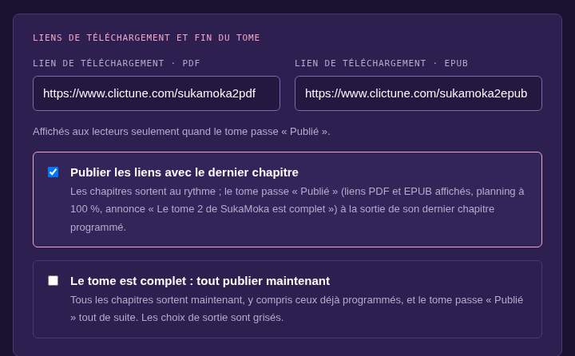{largeur=80%}

1. Ouvrez **Ajouter des chapitres** et choisissez le tome.
2. Déposez le fichier avec les derniers chapitres (ou le tome entier).
3. Collez le **Lien de téléchargement · PDF** et le **Lien de téléchargement · EPUB**.
4. Choisissez le moment :
   - **Publier les liens avec le dernier chapitre** : les chapitres sortent selon la sortie choisie (**Maintenant**, **Un par un, au rythme** ou **À une date**). Le tome passe « Publié » à la sortie du dernier chapitre programmé, ou tout de suite si rien n'est programmé ;
   - **Le tome est complet : tout publier maintenant** : tous les chapitres sortent maintenant, même ceux déjà programmés, et le tome passe « Publié » aussitôt.
5. Cliquez sur le bouton d'envoi, puis confirmez.

Le tome passe « Publié », les liens s'affichent, le planning passe à « Publié », 100 %. L'annonce dit « Le tome 2 de SukaMoka est complet : PDF et EPUB disponibles ».

## Passer un tome à « Publié » depuis sa fiche

Tous les chapitres sont déjà en ligne et il ne manque que les liens ?

1. **Tous les tomes**, puis **Modifier** sur la ligne du tome.
2. Dans l'encadré **État du tome**, choisissez **Publié**.
3. Collez le **Lien PDF** et le **Lien EPUB**.
4. Cochez **Annoncer « Le tome N est complet »** si vous voulez prévenir les lecteurs (décochée par défaut).
5. Cliquez sur **Enregistrer**, puis confirmez si le site le demande.

{largeur=80%}

> **À savoir** : sans la case d'annonce, rien n'est annoncé : ni article, ni Discord, ni e-mail. Voir aussi le chapitre « Nouveau (version 2.1.5) : l'état des tomes et des œuvres ».

## Remplacer un lien PDF ou EPUB mort

1. **Tous les tomes**, puis **Modifier** sur la ligne du tome.
2. Dans l'encadré **État du tome**, sous **Publié**, remplacez le lien.
3. Cliquez sur **Enregistrer**.

# Modifier un tome

Réservé aux éditeurs et aux gérants. La fiche d'un tome s'ouvre dans l'espace équipe, sans passer par l'administration WordPress.

## Trouver un tome

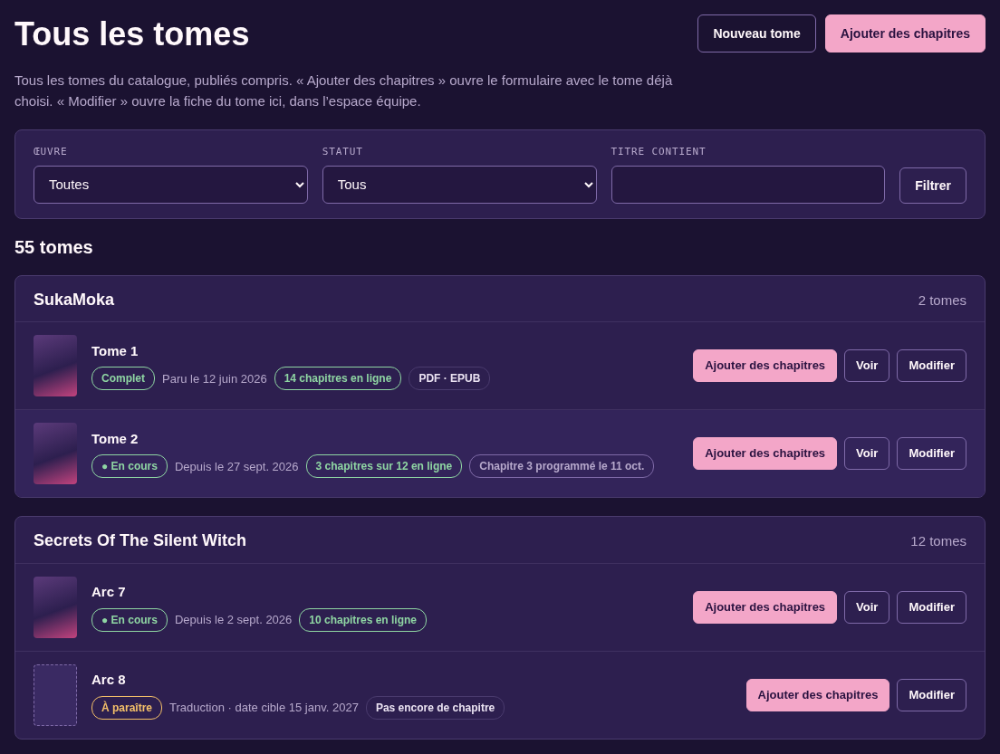

1. Dans le menu, ouvrez **Catalogue**, puis **Tous les tomes**. Les tomes publiés y sont aussi.
2. Filtrez par **Œuvre**, par **Statut** (À paraître, En cours, Complets, Programmés, Brouillons) ou tapez une partie du titre dans **Titre contient**, puis **Filtrer**.
3. Sur la ligne du tome :
   - **Ajouter des chapitres** ouvre le formulaire avec ce tome ;
   - **Voir** ouvre la page publique ;
   - **Modifier** ouvre la fiche du tome.

## Modifier les informations d'un tome

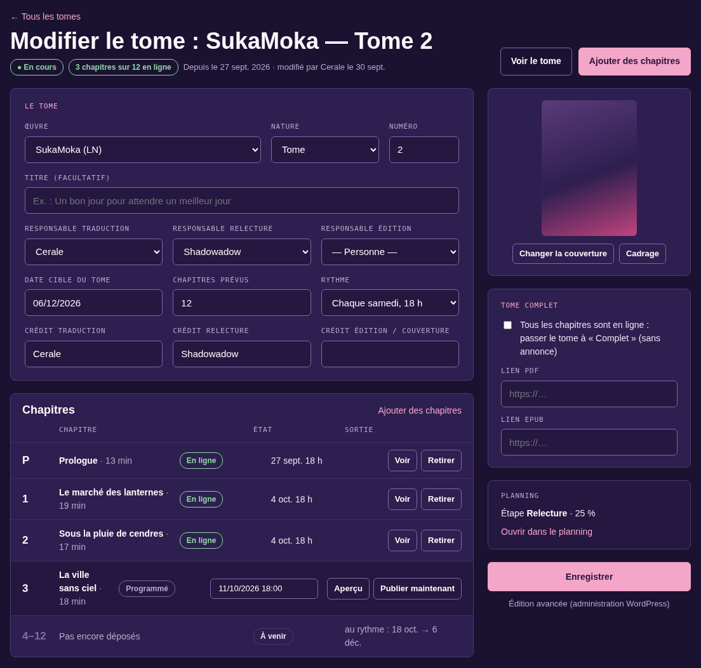

1. Ouvrez la fiche du tome (**Modifier**).
2. Changez ce qu'il faut : œuvre, nature, numéro, titre, responsables, date cible, **Chapitres prévus**, **Rythme**. Ces deux derniers champs sont dans la section **Le tome** : ils se corrigent quel que soit l'état du tome (par exemple 6 prévus, mais le DOCX donne 15 chapitres).
3. Les **Crédits affichés sur la page du tome** : **Crédit traduction**, **Crédit relecture**, **Crédit édition / couverture**.
4. Pour la couverture : **Changer la couverture (facultatif)**. JPG, PNG ou WebP, au format portrait de préférence. Sans couverture propre, celle de l'œuvre est affichée.
5. Cliquez sur **Enregistrer**.

Le résumé **Planning** (étape, avancement) a un lien **Ouvrir dans le planning**. Tout en bas, **Édition avancée (administration WordPress)** ouvre l'ancien écran (rarement utile).

## Publier, reprogrammer ou retirer un chapitre

La liste **Chapitres** de la fiche montre chaque chapitre avec son état : **En ligne**, **Programmé** ou **Brouillon**. Une ligne **À venir** compte les chapitres prévus pas encore déposés.

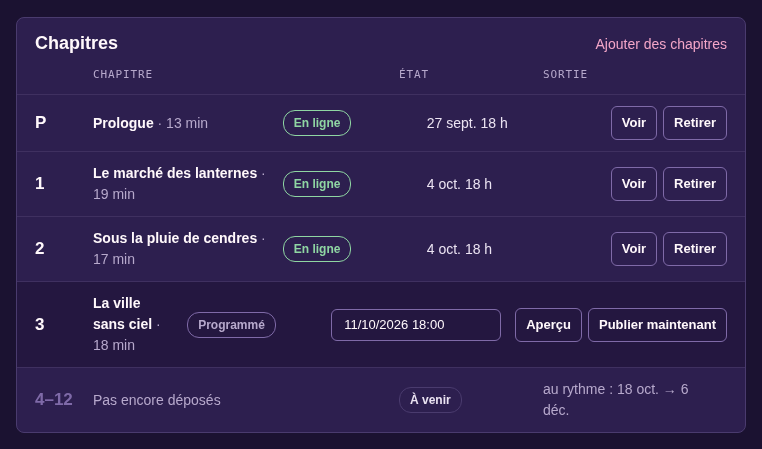{largeur=80%}

- **Publier maintenant** (chapitre programmé ou brouillon) : le chapitre sort tout de suite.
- **Changer la date** (chapitre programmé ou brouillon) : choisissez la date et l'heure, puis cliquez sur le bouton. La date proposée suit le rythme du tome.
- **Retirer** (chapitre en ligne ou programmé) : une question demande confirmation, cliquez sur **Oui, retirer**. Le chapitre repasse en brouillon. Son adresse et ses commentaires sont gardés. Rien n'est annoncé.
- **Voir** (en ligne) ou **Aperçu** (pas encore en ligne) : ouvre le chapitre.

> **À savoir** : la première sortie d'un tome passe toujours par **Ajouter des chapitres**, pour que l'annonce parte. Les boutons de cette liste servent ensuite.

# Nouveau (version 2.1.5) : l'état des tomes et des œuvres

> **Nouveau** : ce chapitre décrit des fonctions de la version 2.1.5. Les images viennent des maquettes : si un détail diffère de l'écran, c'est le texte qui fait foi.

## Le cycle de vie d'un tome

Côté équipe, un tome a trois états. Le site propose l'état tout seul, d'après le planning et les chapitres publiés. L'équipe peut toujours le changer à la main : son choix l'emporte.

| État (équipe) | Ce que voient les lecteurs | Le tome |
| --- | --- | --- |
| **Planifié** | À paraître | En préparation au planning : traduction, relecture, édition. Pas encore lisible. Rappels de retard actifs. |
| **En cours de publication** | En cours | Des chapitres sont en ligne, d'autres arrivent. Lecture chapitre par chapitre, pas encore de PDF ni d'EPUB. |
| **Publié** | Publié | Tous les chapitres sont en ligne. Liens PDF et EPUB affichés, planning à 100 %, plus aucun rappel. |

Un tome publié d'un coup (fichier entier, case « Le tome est complet : tout publier maintenant ») passe directement de **Planifié** à **Publié**, comme avant.

## Changer l'état d'un tome

1. **Tous les tomes**, puis **Modifier** sur la ligne du tome.
2. Dans l'encadré **État du tome**, cliquez sur **Planifié**, **En cours de publication** ou **Publié**.
3. Complétez les réglages qui s'affichent pour cet état :
   - **Planifié** : l'étape et la date cible du planning ;
   - **En cours de publication** : les chapitres en ligne et le prochain chapitre programmé (les **Chapitres prévus** et le **Rythme** se changent dans la section **Le tome**) ;
   - **Publié** : le **Lien PDF**, le **Lien EPUB** et, si vous le souhaitez, l'annonce « Le tome est complet ».
4. Cliquez sur **Enregistrer**.
5. Si le changement touche les lecteurs, une question demande confirmation. Lisez-la, puis confirmez ou annulez.

## Savoir ce que fait chaque changement

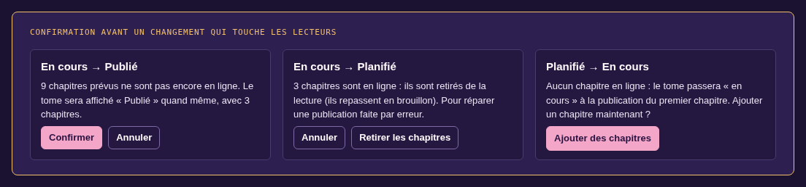

| Changement | Bouton de confirmation | Ce qui se passe |
| --- | --- | --- |
| **Planifié → En cours de publication** | aucun | Rien ne change tant qu'aucun chapitre n'est en ligne. Le site propose d'**Ajouter des chapitres**. |
| **Planifié → Publié** | **Oui, publier le tome** | Le tome et ses chapitres prêts sont publiés. Annonce seulement si vous avez coché la case d'annonce. |
| **En cours de publication → Publié** | **Oui, passer à « Publié »** (demandé s'il manque des chapitres prévus) | Les liens PDF et EPUB s'affichent, le planning passe à « Publié » (100 %). Annonce « Le tome est complet » seulement si la case est cochée. |
| **Publié → En cours de publication** | **Oui, rouvrir le tome** | Le tome est rouvert. Les liens PDF et EPUB sont gardés mais masqués aux lecteurs. Le planning revient à l'étape « Édition ». |
| **En cours de publication → Planifié** | **Oui, retirer de la lecture** | Les chapitres en ligne et programmés repassent en brouillon, le tome aussi, l'annonce est dépubliée et les notifications pas encore parties sont annulées. Le tome redevient « à paraître ». |
| **Publié → Planifié** | cocher **Je comprends que le tome entier ne sera plus lisible**, puis **Oui, retirer le tome de la lecture** | Même retrait, pour le tome entier. |

> **Attention** : le retour **En cours de publication → Planifié** retire les chapitres que les lecteurs pouvaient lire. Il sert à réparer une publication faite par erreur. Pour arrêter un tome sans rien retirer, mettez-le plutôt en pause (voir « Mettre un tome en pause »).

## J'ai publié au lieu de programmer : comment réparer

Exemple : vous vouliez programmer le prologue pour samedi, mais vous avez cliqué sur **Maintenant**. Le tome est passé « En cours » et l'annonce est partie.

1. **Tous les tomes**, puis **Modifier** sur la ligne du tome.
2. Dans **État du tome**, choisissez **Planifié**.
3. Cliquez sur **Enregistrer**, puis confirmez avec **Oui, retirer de la lecture**. Le prologue n'est plus lisible, l'annonce est dépubliée et le tome redevient « à paraître ».
4. Ouvrez **Ajouter des chapitres**, choisissez le tome et déposez de nouveau le fichier : le prologue apparaît **Brouillon**.
5. Choisissez **À une date**, indiquez samedi 18 h, puis cliquez sur **Programmer 1 chapitre** et confirmez. Le prologue sortira samedi, avec son annonce.
6. Prévenez l'équipe sur Discord : le message Discord et les e-mails déjà partis ne peuvent pas être repris. L'article d'annonce, lui, a été dépublié et reviendra à la vraie sortie.

> **Astuce** : si un seul chapitre est sorti trop tôt dans un tome déjà en cours, pas besoin de changer l'état du tome. Utilisez **Retirer** sur la ligne du chapitre, puis **Changer la date** (voir « Publier, reprogrammer ou retirer un chapitre »).

## Changer l'état d'une œuvre

L'état d'une œuvre se change directement dans la liste **Œuvres**, sans ouvrir sa fiche. Il s'affiche sur la bibliothèque, sur la fiche de l'œuvre et dans ses filtres. L'état de chaque tome est rappelé à côté.

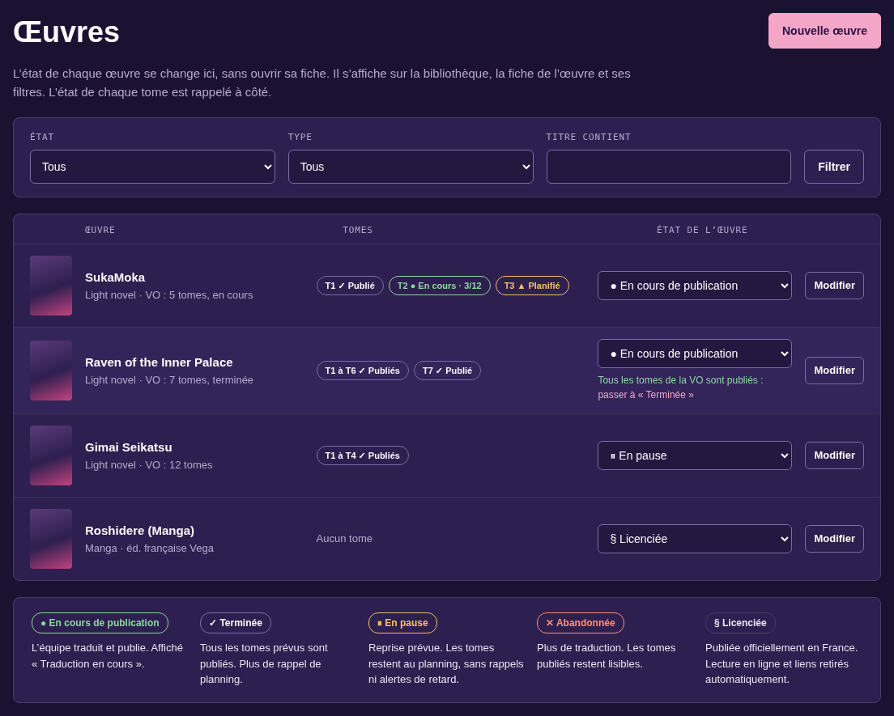

1. Dans le menu, ouvrez **Catalogue**, puis **Œuvres**.
2. Pour retrouver une œuvre, filtrez par **État**, par type, ou tapez une partie du titre.
3. Sur la ligne de l'œuvre, choisissez son nouvel état dans la liste **État de l'œuvre**.
4. Cliquez sur **Changer**. Pour entrer dans « Licenciée » ou en sortir, l'écran **Ce qui va changer** s'ouvre : lisez-le, puis cliquez sur **Confirmer : passer à « … »**.

Vous pouvez aussi changer l'état dans la fiche de l'œuvre (**Modifier**, champ **État de l'œuvre**) : les mêmes confirmations s'appliquent.

| État de l'œuvre | Ce que fait le site |
| --- | --- |
| **En cours de publication** | L'équipe traduit et publie. Les lecteurs voient « Traduction en cours ». |
| **Terminée** | Tous les tomes prévus sont publiés. Plus de rappel de planning. Quand tous les tomes de la VO sont « Publié », le site propose de passer à « Terminée », sans l'imposer. |
| **En pause** | Une reprise est prévue. Les tomes restent au planning, mais le site n'envoie **plus aucun rappel ni alerte de retard** pour cette œuvre. |
| **Abandonnée** | Plus de traduction. Les tomes publiés restent lisibles. Plus de rappel. |
| **Licenciée** | L'œuvre est publiée officiellement en France. Le site **retire automatiquement la lecture en ligne et les liens PDF et EPUB** de tous ses tomes et annule les e-mails d'alerte en attente. La fiche de l'œuvre et ses tomes restent en ligne, avec la mention « Licenciée ». Plus de rappel. |

> **Attention** : **Licenciée** retire tout de suite la lecture et les liens de toute l'œuvre. Vérifiez avec un gérant avant de choisir cet état.

> **À savoir** : c'est réversible. En quittant « Licenciée », la case **Remettre en ligne la lecture et les liens retirés à la licence** (cochée par défaut) remet tout en ligne, sans aucune annonce.

# Ce que voient les lecteurs

Il est utile de savoir ce que montre le site, pour répondre aux lecteurs sur Discord.

> **Nouveau** : depuis la version 2.1.6, l'accueil a une section **Planning** à la place de la carte « Prochaines sorties », et la page Planning montre le prochain tome et une vue **Chapitres**. Rien n'est à saisir en plus : tout vient du planning, des chapitres publiés ou programmés avec **Ajouter des chapitres**, et des champs **Chapitres prévus** et **Rythme** du tome.

## La page d'accueil

En haut, **Dernières sorties** ne change pas : les derniers tomes et chapitres parus. Juste en dessous, la section **Planning**, sur toute la largeur.

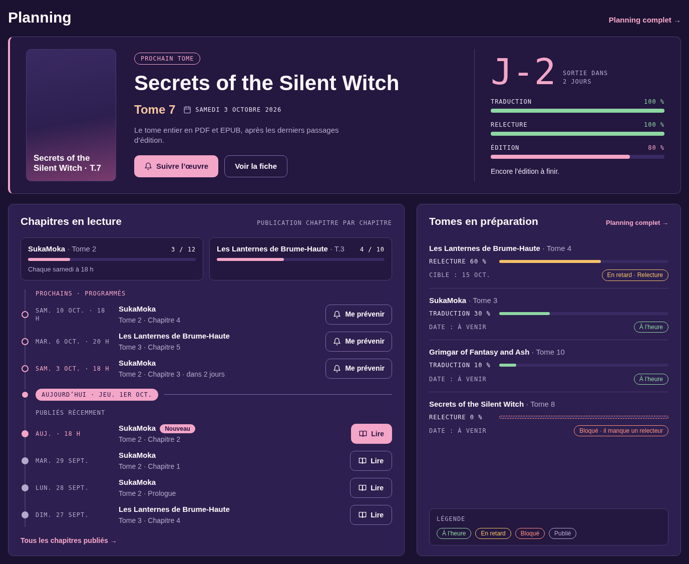

- **À la une : prochain tome** : la couverture, l'œuvre, le tome, la date de sortie et un compte à rebours (« J-2 »). À droite, les barres **Traduction**, **Relecture** et **Édition**. Les boutons **Suivre l'œuvre** et **Voir la fiche**.
- **Chapitres en lecture**, à gauche :
  - les tomes publiés chapitre par chapitre, avec leur progression (« 3 / 12 ») et leur rythme (« Chaque samedi à 18 h ») ;
  - **Prochains · programmés** : les prochains chapitres programmés, avec leur date et le bouton **Me prévenir** ;
  - le repère **Aujourd'hui** ;
  - **Publiés récemment** : les chapitres parus ces 14 derniers jours, avec **Lire**. Un chapitre de moins de 48 h porte le badge **Nouveau** ;
  - le lien **Tous les chapitres publiés**.
- **Tomes en préparation**, à droite : les tomes suivants, avec leur étape, le pourcentage, la date cible (ou « à venir ») et une pastille d'état (**À l'heure**, **En retard**, **Bloqué**). Une légende explique les pastilles.

Les deux colonnes ont la même hauteur. Sur téléphone, elles deviennent deux onglets : **Chapitres** et **Tomes**. Viennent ensuite, sans changement, les **Actualités**, le Discord et **Nos partenaires**.

> **À savoir** : seules les œuvres publiques apparaissent. Un chapitre retiré (licence, retour d'un tome à « Planifié ») n'apparaît jamais.

## La page Planning

La page **yumenovel.fr/planning/** garde tout ce qu'elle montrait : l'introduction, les filtres, les boutons **Flux RSS**, **JSON** et **S'abonner au calendrier (ICS)**, **En bref**, le tableau, le calendrier, le journal et la légende. Ce qui change :

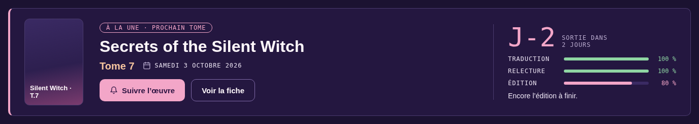

- Sous l'introduction, le bandeau **À la une : prochain tome**, comme à l'accueil.
- Trois vues au lieu de deux : **Tableau**, **Chapitres** et **Calendrier**.
- Dans le tableau, chaque étape a sa barre d'avancement avec son pourcentage.
- Un tome publié chapitre par chapitre affiche « En cours · 3 chapitres sur 12 », une petite barre, « Prochain : ch. 3 · sam. 3 oct. 18 h » et la pastille **En cours de publication**.
- Sur téléphone, le tableau devient une carte par tome.

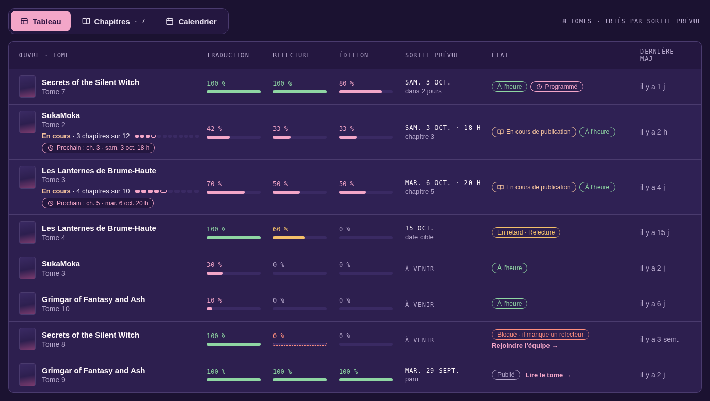

La vue **Chapitres** remplace le tableau par la file des chapitres, groupée par jour : les prochains chapitres programmés, le repère « Aujourd'hui », puis les chapitres publiés. Un encadré rappelle que **les sorties de tomes sont aussi dans le calendrier ICS** (les chapitres n'y sont pas).

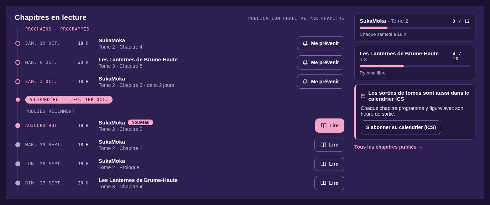

La légende a deux entrées de plus : **En cours de publication** (le tome sort chapitre par chapitre) et **Chapitre programmé** (la date et l'heure du prochain chapitre).

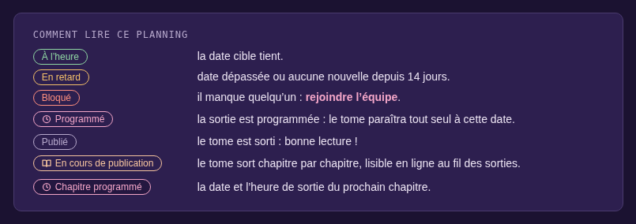{largeur=60%}

## Faire apparaître un chapitre dans « Prochains » de l'accueil

Un chapitre apparaît dans **Prochains · programmés** dès qu'il est programmé. Il n'y a rien d'autre à faire.

1. Ouvrez **Ajouter des chapitres** et choisissez le tome.
2. Déposez le DOCX.
3. Dans la partie 3, choisissez **Un par un, au rythme** (un chapitre à chaque date du rythme du tome) ou **À une date** (le jour et l'heure choisis).
4. Cliquez sur le bouton **Programmer** (son texte donne le nombre de chapitres, par exemple **Programmer 1 chapitre**), puis confirmez.

L'accueil montre les 3 prochains chapitres programmés. À sa sortie, le chapitre passe dans **Publiés récemment**, avec le badge **Nouveau** pendant 48 h, et y reste 14 jours.

> **À savoir** : un chapitre publié tout de suite (**Maintenant**) va directement dans **Publiés récemment**. Pour que l'accueil affiche « 3 / 12 » et le rythme, remplissez **Chapitres prévus** et **Rythme** dans la fiche du tome (voir « Modifier les informations d'un tome »).

## Mettre un tome à la une

Le site choisit tout seul le tome à la une : le tome à venir dont la date de sortie est la plus proche. Pour qu'un tome y figure :

1. Donnez-lui une **Date cible** au planning (dans **Mes tâches** ou dans **Modifier le tome**), ou programmez sa sortie avec **Ajouter des chapitres** (**À une date**).
2. Vérifiez qu'aucun autre tome à venir n'a une date plus proche.

La date programmée compte en priorité ; sinon, c'est la date cible.

> **Attention** : un tome **bloqué** n'est jamais à la une. Le tome suivant prend sa place jusqu'à ce que **Tome bloqué** soit décoché.

> **À savoir** : un tome déjà en cours de publication chapitre par chapitre n'est pas à la une : il apparaît dans **Chapitres en lecture**. Un tome publié, ou d'une œuvre qui n'est pas publique, n'y est jamais non plus.

## La fiche d'une œuvre

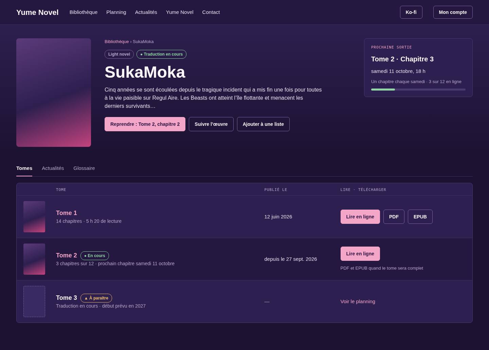

- En haut : la couverture, le type, l'état de la traduction, le synopsis et les boutons pour reprendre la lecture, mettre l'œuvre en favori (avec une alerte à chaque sortie) et l'**Ajouter à une liste**.
- À droite : la **Prochaine sortie**, quand un chapitre est programmé.
- La liste des tomes : chaque tome avec sa parution (**À paraître**, **En cours**, **Publié**), **Lire en ligne** et, pour un tome publié, **PDF** et **EPUB**.
- Les onglets **Actualités** et **Glossaire** apparaissent quand l'œuvre en a.

## La page d'un tome en cours

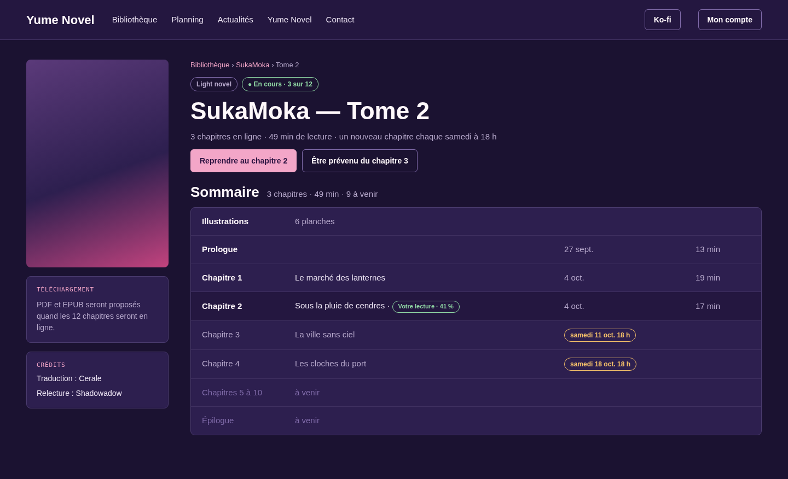

- Le titre, « En cours · 3 sur 12 » et le rythme : « un nouveau chapitre chaque samedi à 18 h ».
- Le **Sommaire** : les chapitres en ligne, les chapitres programmés avec leur date, puis les chapitres « à venir ».
- **PDF et EPUB seront proposés quand les 12 chapitres seront en ligne** : les liens n'apparaissent qu'une fois le tome complet.
- Les **Crédits** : traduction, relecture, édition.

# Glossaires, actualités et commentaires

## Publier le glossaire d'une œuvre

Réservé aux éditeurs et aux gérants. Le glossaire vient du fichier `glossaire.yaml` de Yume-Trad.

1. Dans le menu, ouvrez **Catalogue**, puis **Glossaires**.
2. Sous **Téléverser un glossaire**, choisissez l'**Œuvre** et le **Fichier YAML (4 Mo au plus)**.
3. Cliquez sur **Vérifier**. Rien n'est publié : le site affiche le nombre d'entrées et les entrées ignorées.
4. Si le bilan est bon, cliquez sur **Publier le glossaire**. Le nouveau fichier remplace l'ancien.

Les 5 dernières versions restent disponibles : **Télécharger ce YAML** ou **Restaurer cette version**.

## Lier une actualité à une œuvre

Un article d'actualité lié à une œuvre apparaît sur sa fiche, dans l'onglet **Actualités**. Pour le lier, cochez l'œuvre dans le panneau **Œuvres liées** de l'éditeur d'article. Les annonces de sortie sont liées toutes seules.

## Modérer les commentaires

Réservé aux éditeurs et aux gérants. L'entrée **Commentaires (N)** apparaît dans le menu dès qu'il y a quelque chose à modérer. Elle liste les commentaires **signalés** par les lecteurs, puis ceux **En attente**.

Pour chaque commentaire :

- **Approuver** : le publie et classe ses signalements ;
- **Ignorer les signalements** : le commentaire reste en ligne ;
- **Indésirable** : pour la publicité et le spam ;
- **Corbeille** : pour ce qui enfreint les règles (insultes, spoilers non signalés, liens pirates).

> **À savoir** : au 3ᵉ signalement, un commentaire est masqué en attendant votre décision. Un commentaire d'un membre de l'équipe n'est jamais masqué tout seul.

> **Astuce** : un commentaire signale une coquille ? Corrigez le chapitre (voir « Corriger un chapitre déjà en ligne »), répondez « Corrigé, merci ! », puis approuvez ou supprimez le commentaire.

# Questions fréquentes

| Question | Réponse |
| --- | --- |
| Je ne vois pas mon tome dans **Mes tâches**. | Vous n'en êtes pas responsable. Demandez à un éditeur ou à un gérant de vous l'attribuer. |
| Le planning dit « En retard » alors que j'avance. | Personne n'a mis le tome à jour depuis 14 jours. Enregistrez votre avancement, même sans changer d'étape. |
| Je ne vois pas **Ajouter des chapitres** ni **Œuvres**. | Ces menus sont réservés aux éditeurs et aux gérants. |
| Un tome est arrêté mais reçoit des rappels. | **Planning complet**, dépliez sa ligne, **Mettre en pause**. **Reprendre** le jour où il repart. |
| J'ai créé un tome par erreur. | **Planning complet**, dépliez sa ligne, **Retirer du planning** (tome brouillon sans chapitre en ligne). |
| J'ai publié un chapitre trop tôt. | Fiche du tome, ligne du chapitre : **Retirer**, puis **Changer la date**. Pour un tome entier, voir « J'ai publié au lieu de programmer : comment réparer ». |
| Tous les chapitres de mon fichier sont sortis d'un coup. | Tous les chapitres **Nouveau** sortent ensemble. La prochaine fois, choisissez **Un par un, au rythme**, ou déposez un fichier avec les seuls chapitres à publier. |
| Les chapitres sont mal découpés. | Vérifiez les styles **Titre 1** dans Word et déposez de nouveau le fichier. Sinon, découpez vous-même (voir « Découper soi-même les chapitres »). |
| Un lien PDF ou EPUB ne marche plus. | **Tous les tomes**, **Modifier**, encadré **État du tome** (**Publié**) : remplacez le lien, puis **Enregistrer**. |
| Le tome publié n'apparaît pas sur le site. | Il est encore en brouillon ou programmé. Vérifiez son statut dans **Tous les tomes** (filtre **Statut**). |
| Un lecteur ne reçoit pas les alertes. | Il doit avoir l'œuvre en favori, avec une alerte active (page **Mon compte**). |
| J'ai oublié mon mot de passe. | Lien **Mot de passe oublié ?** sur la page de connexion. |

# En cas de problème

## Qui contacter

| Problème | Qui contacter |
| --- | --- |
| Un rôle à changer, un accès qui manque, un tome à attribuer | Un **gérant** |
| Une coquille, un chapitre à corriger ou à publier | Un **éditeur Yume** |
| Une page cassée, un bouton qui ne répond plus, un message d'erreur | L'**équipe technique**, sur le Discord de l'équipe |
| Un compte bloqué, un changement d'adresse e-mail | Un **administrateur** (via un gérant) |

Tout passe par le **Discord de l'équipe**. Le site ne recueille aucune demande par formulaire.

## Signaler un problème

Pour qu'on puisse vous aider vite, envoyez sur Discord :

1. l'adresse de la page (copiez-la depuis la barre d'adresse) ;
2. ce que vous vouliez faire, et sur quel tome ;
3. le message affiché, en entier ;
4. une capture d'écran.

> **Astuce** : beaucoup de messages expliquent eux-mêmes quoi faire. Par exemple « Votre session a expiré : rechargez la page puis réessayez. » : rechargez la page (touche **F5**) et recommencez.

> **À savoir** : le site se met à jour tout seul quand l'équipe technique publie une nouvelle version. Rien à faire de votre côté. Ce guide est mis à jour en même temps : vérifiez sa version en bas de page.
